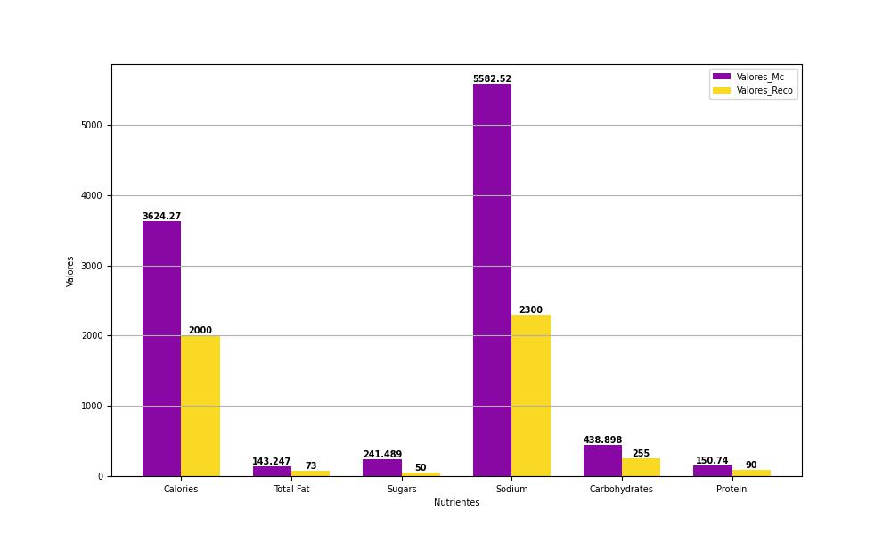

# 🍔 Informações nutricionais para o cardápio do McDonald's

#### Fonte de dados
*[Informações nutricionais para o cardápio do McDonald's](https://www.kaggle.com/datasets/mcdonalds/nutrition-facts) do Kaggle

##### Ferramentas utilizadas
* **Python** para tratamento, limpeza e visualização de dados

### Perguntas
* Qual é a categoria no menu é mais calórica ?
* Quantas calorias são ingeridas se nos alimentarmos apenas no McDonald's por um dia?

[Notebook](menu.ipynb)

#### Calorias diárias recomendadas x Calorias McDonald's
   

